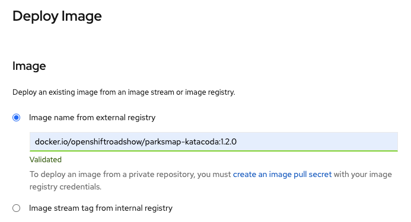

# Lab 1 : Connect to Openshift and create your first application using the Web interface

In this lab, we will connect to OpenShift and create an application from the Web Interface

## Step 1 : Exploring The Web Console

### Exercise: Logging in with the Web Console

To begin, click on the **Console** tab on your screen. This will open the web console on your browser.

You should see a **Red Hat OpenShift Container Platform** window with **Username** and **Password** forms as shown below:

{: width='600px' border='2'}

**Username:** `developer`

**Password:** `developer`

After logging in to the web console, you'll be on a *Projects* page.

### What is a project? Why does it matter?

OpenShift is often referred to as a container application platform in that it is a platform designed for the development and deployment of applications in containers.

To group your application, we use projects. The reason for having a project to contain your application is to allow for controlled access and quotas for developers or teams.

More technically, it's a visualization of the Kubernetes namespace based on the developer access controls.

### Exercise: Creating a Project

Click the blue **Create Project** button.

You should now see a page for creating your first project in the web console. Fill in the *Name* field as `myproject`.

{: width='600px' border='2'}

The rest of the form is optional and up to you to fill in or ignore. Click *Create* to continue.

After your project is created, you will see some basic information about your project.

### Exercise: Explore the Administrator and Developer Perspectives

Notice the navigation menu on the left. When you first log in, you'll typically be in the *Administrator Perspective*. If you are not in the *Administrator Perspective*, click the perspective toggle and switch from **Developer** to **Administrator**.

{: width='600px' border='2'}

You're now in the *Administrator Perspective*, where you'll find **Operators**, **Workloads**, **Networking**, **Storage**, **Builds**, and **Administration** menus in the navigation.

Take a quick look around these, clicking on a few of the menus to see more options.

Now, toggle to the *Developer Perspective*. We will spend most of our time in this tutorial in the *Developer Perspective*. The first thing you'll see is the *Topology* view. Right now it is empty, and lists several different ways to add content to your project. Once you have an application deployed, it will be visualized here in *Topology* view.

## Step 3 - Deploying a Docker Image

In this section, you are going to deploy the front end component of an application called **parksmap**. The web application will display an interactive map, which will be used to display the location of major national parks from all over the world.

### Exercise: Deploying Your First Image

The simplest way to deploy an application in OpenShift is to take an existing container image and run it. We are going to use the OpenShift web console to do this, so ensure you have the OpenShift web console open with the *Developer Perspective* active and that you are in the project called `myproject`.

The OpenShift web console provides various options to deploy an application to a project. For this section, we are going to use the *Container Image* method. As the project is empty at this point, the *Topology* view should display the following options: *From Git*, *Container Image*, *From Catalog*, *From Dockerfile*, *YAML*, and *Database*.

Choose the **Container Image** option.


In the future, to get back to this menu of ways to add content to your project, you can click *+Add* in the left navigation.

Within the *Deploy Image* page, enter the following for *Image name from external registry*:

```
docker.io/openshiftroadshow/parksmap-katacoda:1.2.0
```

Press tab or click outside of the text box to validate the image:



The *Application Name* field will be populated with `parksmap-katacoda-app` and the *Name* field with `parksmap-katacoda`. This name will be what is used for your application and the various components created that relate to it. Leave this as the generated value as steps given in the upcoming sections will use this name.

By default, creating a deployment using the *Container Image* method will also create a Route for your application. A Route makes your application available at a publicly accessible URL.


Normally, you would keep this box checked, since it's very convenient to have the Route created for you. For the purposes of learning, **un-check the box**. We'll learn more about Routes later in the tutorial, and we'll create the Route ourselves then.

You are ready to deploy the existing container image. Click the blue *Create* button at the bottom of the screen. This should bring you back to the *Topology* view, where you'll see a visual representation of the application you just deployed. As the image deployment progresses, you'll see the ring around the `parksmap-katacoda` deployment progress from white to light blue to blue.


These are the only steps you need to run to get a "vanilla" container image deployed on OpenShift. This should work with any container image that follows best practices, such as defining the port any service is exposed on, not needing to run specifically as the *root user* or other dedicated user, and which embeds a default command for running the application.

## Step 3 - Scaling Your Application

Let's scale our application up to 2 instances of the pods. You can do this by clicking inside the circle for the `parksmap-katacoda` application from *Topology* view to open the side panel. In the side panel, click the *Details* tab, and then click the "up" arrow next to the *Pod* in side panel.


To verify that we changed the number of replicas, click the *Resources* tab in the side panel. You should see a list with your pods similar to the image below:


You can see that we now have 2 replicas.

Overall, that's how simple it is to scale an application (*Pods* in a *Service*). Application scaling can happen extremely quickly because OpenShift is just launching new instances of an existing image, especially if that image is already cached on the node.

### Application "Self Healing"

OpenShift's *Deployments* are constantly monitoring to see that the desired number of *Pods* is actually running. Therefore, if the actual state ever deviates from the desired state (i.e., 2 pods running), OpenShift will work to fix the situation.

Since we have two *Pods* running right now, let's see what happens if we "accidentally" kill one.

On the *Resources* tab where you viewed the list of pods after scaling to 2 replicas, open one of the pods by clicking its name in the list.

In the top right corner of the page, there is an *Actions* drop down menu. Click it and select *Delete Pod*.


After you click *Delete Pod*, click *Delete* in the confirmation dialog. You will be taken to a page listing pods, however, this time, there are three pods. Note that on smaller screens you may not see all of these columns.


The pod that we deleted is terminating (i.e., it is being cleaned up). A new pod was created because OpenShift will always make sure that, if one pod dies, there is going to be new pod created to fill its place.

### Exercise: Scale Down

Before we continue, go ahead and scale your application down to a single instance. Click *Topology* to return to the *Topology* view, then click `parksmap-katacoda` and on the *Overview* tab, click the down arrow to scale back down to one instance.

## Step 5 - Routing HTTP Requests

*Services* provide internal abstraction and load balancing within an OpenShift environment, but sometimes clients (users, systems, devices, etc.) **outside** of OpenShift need to access an application. The way that external clients are able to access applications running in OpenShift is through the OpenShift routing layer. The resource object which controls this is a *Route*.

The default OpenShift router (HAProxy) uses the HTTP header of the incoming request to determine where to proxy the connection. You can optionally define security, such as TLS, for the *Route*. If you want your *Services*, and, by extension, your *Pods*, to be accessible to the outside world, you need to create a *Route*.

As we mentioned earlier in the tutorial, the *Container Image* method of deploying an application will create a *Route* for you by default. Since we un-checked that option, we will manually create a *Route* now.

### Exercise: Creating a Route

Fortunately, creating a *Route* is a pretty straight-forward process. First, go to the *Administrator Perspective* by switching to *Administrator* in the *Developer* drop down menu. Ensure that your `myproject` project is selected from the projects list. Next, click *Networking* and then *Routes* in the left navigation menu.

Click the blue *Create Route* button.


Enter `parksmap-katacoda` for the *Route* Name, select `parksmap-katacoda` for the *Service*, and `8080` for the Target Port. Leave all the other settings as-is.


Once you click *Create*, the *Route* will be created and displayed in the *Route Details* page.


You can also view your *Route* in the *Developer Perspective*. Toggle back to the *Developer Perspective* now, and go to *Topology* view. On the `parksmap-katacoda` visualization you should now see an icon in the top right corner of the circle. This represents the *Route*, and if you click it, it will open the URL in your browser.


Once you've clicked the *Route* icon, you should see this in your browser:


## Step 5 - Building From Source Code

In this section, you are going to deploy a backend service for the ParksMap application. This backend service will provide data, via a REST service API, on major national parks from all over the world. The ParksMap front end web application will query this data and display it on an interactive map in your web browser.

### Background: Source-to-Image (S2I)

In a previous section, you learned how to deploy an application (the ParksMap front end) from a pre-existing container image. Here you will learn how to deploy an application direct from source code hosted in a remote Git repository. This will be done using the [Source-to-Image (S2I)](https://github.com/openshift/source-to-image) tool.

The documentation for S2I describes itself in the following way:

> Source-to-image (S2I) is a tool for building reproducible container images. S2I produces ready-to-run images by injecting source code into a container image and assembling a new container image which incorporates the builder image and built source. The result is then ready to use with docker run. S2I supports incremental builds which re-use previously downloaded dependencies, previously built artifacts, etc.

OpenShift is S2I-enabled and can use S2I as one of its build mechanisms (in addition to building container images from Dockerfiles and "custom" builds).

A full discussion of S2I is beyond the scope of this tutorial. More information about S2I can be found in the [OpenShift S2I documentation](https://docs.openshift.com/container-platform/latest/builds/understanding-image-builds.html#build-strategy-s2i_understanding-image-builds) and the [GitHub project respository for S2I](https://github.com/openshift/source-to-image).

The only key concept you need to remember about S2I is that it handles the process of building your application container image for you from your source code.

### Exercise: Deploying the application code

The backend service that you will be deploying in this section is called `nationalparks-katacoda`. This is a Python application that will return map coordinates of major national parks from all over the world as JSON via a REST service API. The source code repository for the application can be found on GitHub at:

- [https://github.com/openshift-roadshow/nationalparks-katacoda](https://github.com/openshift-roadshow/nationalparks-katacoda)

To deploy the application you are going to use the **+Add** option in the left navigation menu of the *Developer Perspective*, so ensure you have the OpenShift web console open and that you are in the project called `myproject`. Click **+Add**. This time, rather than using *Container Image*, choose *From Catalog*, which will take you to the following page:


If you don't see any items, then uncheck the **Operator Backed** checkbox. Under the **Languages** section, select Python in the list of supported languages. When presented with the options of *Django + Postgres SQL*, *Django + Postgres SQL (Ephemeral)*, and *Python*, select the *Python* option and click on *Create Application*.


For the *Git Repo URL* use:

`https://github.com/openshift-roadshow/nationalparks-katacoda`


Once you've entered that, click outside of the text entry field, and then you should see the *Name* of the application show up as `nationalparks-katacoda`. The *Name* needs to be `nationalparks-katacoda` as the front end for the ParksMap application is expecting the backend service to use that name.

Leave all other options as-is.

Click on *Create* at the bottom right corner of the screen and you will return to the *Topology* view. Click on the circle for the `nationalparks-katacoda` application and then the *Resources* tab in the side panel. In the *Builds* section, you should see your build running.


This is the step where S2I is run on the application source code from the Git repository to create the image which will then be run. Click on the *View Logs* link for the build and you can follow along as the S2I builder for Python downloads all the Python packages required to run the application, prepares the application, and creates the image.


Head back to *Topology view* when the build completes to see the image being deployed and the application being started up. The build is complete when you see the following in the build logs: `Push successful`.


The green check mark in the bottom left of the `nationalparks-katacoda` component visualization indicates that the build has completed. Once the ring turns from light blue to blue, the backend `nationalparks-katacoda` service is deployed.

Now, return to the ParksMap front end application in your browser, and you should now be able to see the locations of the national parks displayed. If you don't still have the application open in your browser, go to *Topology* view and click the icon at the top right of the circle for the `parksmap-katacoda` application to open the URL in your browser.


Congratulations! You just finished learning the basics of how to get started with the OpenShift Container Platform.
