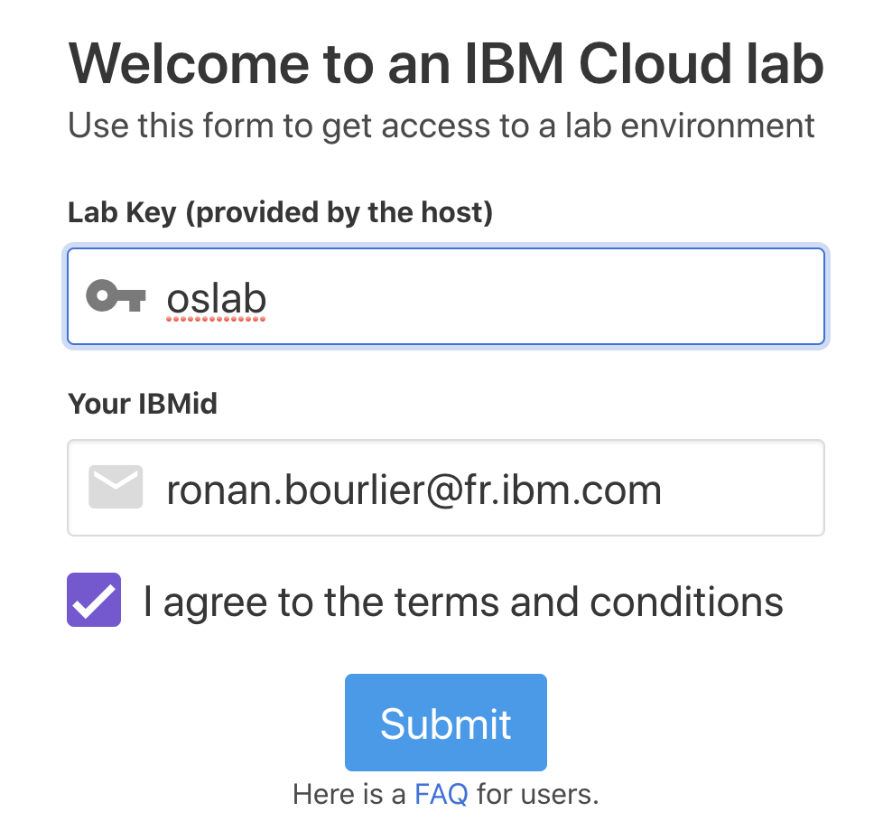

# Prerequisites to the Labs

## Ask for an access

You first need an IBM Cloud account, then you need to request an access to an OpenShift cluster in IBM Cloud.

Here are the steps.

### IBM Cloud account creation

Please [watch this 3 min video]([https://www.youtube.com/watch?v=HBkY-Fs1d6E](https://www.youtube.com/watch?v=HBkY-Fs1d6E)) to better understand IBM Watson Cloud and the process to create an account. The first 2 minutes are enough to create the account.

#### Step 1: Getting a free IBM Cloud account

Create an account on IBM Cloud to try Watson services for free with no time restrictions: [Sign up for free](https://ibm.co/34uskTV). You'll receive an email to confirm and activate your account.

### Request Access

Once your IBM account is created, you can now request an access to an Opeshift instance. Go to [https://ocp-intro-meetup.mybluemix.net/](https://ocp-intro-meetup.mybluemix.net/).

The Lab Key is `oslab` and you IBMid is the email address you used for you registration. Accept the terms and condition and click on Submit.

{: width='600px' border='2'}

Then you should get a quick answer letting you know that you get an access.

{: width='600px' border='2'}

Click on "IBM Cloud Account", and it will open your IBM Cloud account page.

You should have one cluster in the list.

Click on the cluster name. This screenshot is from my first access, it explains why the name is different.

Click on "OpenShift web console" to open the web console.

You now have access to the Web Console

## OC command line installation

### Usage from IBM Cloud shell

For this lab, it is easier to use the IBM Cloud Shell, where all tools are already installed.

Go to [https://shell.cloud.ibm.com](https://shell.cloud.ibm.com).

It opens a shell prompt where you can use all IBM Cloud tools, including the oc command.

You can then follow the instructions below at the step "Accessing your cluster"

### Installation on your workstation

This is the steps to follow to install the CLI tools on your workstation.

Go back to the Cluster page and click on Access.

Follow the steps to access your cluster from the command line.

